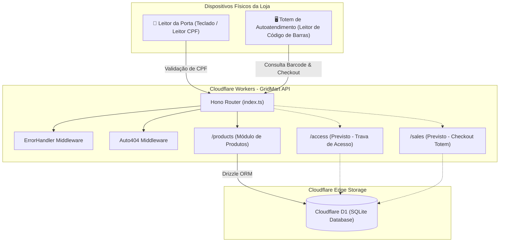
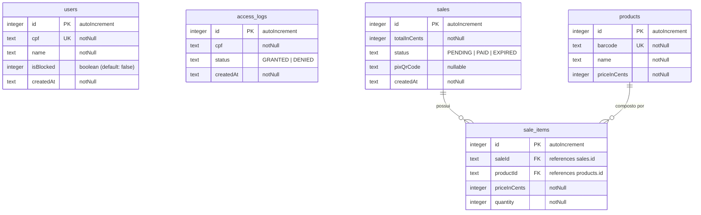

# 🛒 GridMart API

> **API Edge-Native para Mercados Autônomos e Lojas de Conveniência Inteligentes (Honest Market / Micromarket)**

A **GridMart API** é o backend central de uma solução de varejo autônomo sem atendentes (conceito de micromercado/honest market, totens de autoatendimento e controle de trava eletrônica de acesso). Construída com foco em altíssima performance, baixa latência e execução no *Edge* utilizando o ecossistema da Cloudflare.

---

## 📑 Índice

- [Visão Geral e Conceito](#-visão-geral-e-conceito)
- [Stack Tecnológica](#-stack-tecnológica)
- [Arquitetura da Aplicação](#-arquitetura-da-aplicação)
- [Estrutura do Projeto](#-estrutura-do-projeto)
- [Modelagem do Banco de Dados (Schema D1)](#-modelagem-do-banco-de-dados-schema-d1)
- [Middlewares do Sistema](#-middlewares-do-sistema)
- [Documentação das Rotas da API](#-documentação-das-rotas-da-api)
  - [Módulo de Produtos (`/products`)](#módulo-de-produtos-products)
- [Utilitários](#-utilitários)
- [Convenções e Boas Práticas Adotadas](#-convenções-e-boas-práticas-adotadas)
- [Roadmap de Próximas Funcionalidades](#-roadmap-de-próximas-funcionalidades)
- [Guia de Configuração e Execução Local](#-guia-de-configuração-e-execução-local)
- [Licença](#-licença)

---

## 💡 Visão Geral e Conceito

O GridMart atende a dois grandes fluxos operacionais de uma loja física autônoma:

1. **Controle de Acesso da Trava da Porta**:
   - Validação do cliente via CPF na entrada da loja.
   - Verificação se o usuário está cadastrado e ativo (`isBlocked = false`).
   - Registro de logs de auditoria de entrada (`access_logs`) com status `GRANTED` ou `DENIED`.

2. **Autoatendimento & Checkout no Totem**:
   - Consulta ágil de produtos por leitor de código de barras (`barcode`).
   - Criação de vendas vinculadas aos itens selecionados.
   - Geração de cobrança via QR Code PIX e conciliação do status do pedido.

---

## 🛠️ Stack Tecnológica

| Tecnologia | Finalidade | Justificativa / Benefício |
| :--- | :--- | :--- |
| **[TypeScript](https://www.typescriptlang.org/)** | Linguagem Principal | Tipagem estática rigorosa, produtividade e confiabilidade. |
| **[Hono](https://hono.dev/)** | Framework Web | Framework minimalista e ultrarrápido projetado para ambientes serverless e Edge runtimes. |
| **[Cloudflare Workers](https://workers.cloudflare.com/)** | Runtime Serverless | Execução distribuída globalmente na borda com latência próxima de zero. |
| **[Cloudflare D1](https://developers.cloudflare.com/d1/)** | Banco de Dados Relacional | Banco SQL Serverless distribuído baseado em SQLite nativo da Cloudflare. |
| **[Drizzle ORM](https://orm.drizzle.team/)** | ORM / Query Builder | Totalmente type-safe, leve, sem overhead e com suporte de primeira classe ao Cloudflare D1. |
| **[Zod](https://zod.dev/) & [Drizzle-Zod](https://orm.drizzle.team/docs/zod)** | Validação de Schemas | Validação declarativa e segura do payload de requisições HTTP integradas via `@hono/zod-validator`. |

---

## 🏛️ Arquitetura da Aplicação



---

## 📁 Estrutura do Projeto

Abaixo está o mapa atual de diretórios e a responsabilidade de cada arquivo:

```
gridmart-api/
├── db/
│   └── schema.ts                       # Definição das tabelas do banco de dados com Drizzle ORM
├── middlewares/
│   ├── auto404.ts                      # Interceptador para converter retornos vazios/null em HTTP 404
│   └── errorHandler.ts                 # Tratamento global de exceções e erros 500
├── modules/
│   └── products/
│       └── products.routes.ts          # Endpoints do CRUD de produtos e consulta por código de barras
├── utils/
│   └── cpf.ts                          # Algoritmo de validação de CPF (dígitos verificadores)
├── index.ts                            # Ponto de entrada da aplicação Hono, bindings e registro de rotas
└── README.md                           # Documentação do projeto
```

---

## 🗄️ Modelagem do Banco de Dados (Schema D1)

O schema está definido em [`db/schema.ts`](file:///c:/Users/Usuario/gridmart-api/db/schema.ts) utilizando o driver `sqlite-core` do Drizzle ORM.



### Detalhamento das Tabelas

#### 1. `users` (Controle de Clientes)
Armazena os usuários autorizados a acessar a loja física.
- `id` (`INTEGER`, Primary Key, Auto Increment)
- `cpf` (`TEXT`, Not Null, Unique): CPF do cliente utilizado para liberação da trava.
- `name` (`TEXT`, Not Null): Nome completo do cliente.
- `isBlocked` (`INTEGER` / boolean, Default: `false`): Flag para bloquear clientes inadimplentes ou suspensos.
- `createdAt` (`TEXT`, Not Null): Data/hora de registro (formato ISO).

#### 2. `access_logs` (Auditoria da Fechadura)
Histórico de todas as tentativas de destravamento da porta de entrada.
- `id` (`INTEGER`, Primary Key, Auto Increment)
- `cpf` (`TEXT`, Not Null): CPF submetido no leitor da porta.
- `status` (`TEXT`, Not Null): Resultado da tentativa (`'GRANTED'` para liberado, `'DENIED'` para negado).
- `createdAt` (`TEXT`, Not Null): Timestamp do evento de acesso.

#### 3. `products` (Catálogo de Mercadorias)
Produtos comercializados, identificados principalmente pelo código de barras lido no totem.
- `id` (`INTEGER`, Primary Key, Auto Increment)
- `barcode` (`TEXT`, Not Null, Unique): Código de barras (EAN-13, UPC, etc.).
- `name` (`TEXT`, Not Null): Descrição/nome comercial do produto.
- `priceInCents` (`INTEGER`, Not Null): Preço unitário em centavos (ex: `R$ 5,50` = `550`).

#### 4. `sales` (Cabeçalho de Vendas do Totem)
Registra cada carrinho finalizado no totem de autoatendimento.
- `id` (`INTEGER`, Primary Key, Auto Increment)
- `totalInCents` (`INTEGER`, Not Null): Valor total do pedido em centavos.
- `status` (`TEXT`, Not Null): Status do pagamento (`'PENDING'`, `'PAID'`, `'EXPIRED'`).
- `pixQrCode` (`TEXT`, Nullable): String ou payload do QR Code PIX gerado para pagamento.
- `createdAt` (`TEXT`, Not Null): Timestamp de abertura da venda.

#### 5. `sale_items` (Itens da Venda)
Relaciona os produtos ao pedido correspondente, guardando o snapshot do preço no momento da compra.
- `id` (`INTEGER`, Primary Key, Auto Increment)
- `saleId` (`TEXT`, Not Null, FK -> `sales.id`)
- `productId` (`TEXT`, Not Null, FK -> `products.id`)
- `priceInCents` (`INTEGER`, Not Null): Preço unitário praticado na transação.
- `quantity` (`INTEGER`, Not Null): Quantidade do item no carrinho.

---

## 🛡️ Middlewares do Sistema

### 1. `errorHandler` ([`middlewares/errorHandler.ts`](file:///c:/Users/Usuario/gridmart-api/middlewares/errorHandler.ts))
Interceptador global de erros do Hono (`app.onError(errorHandler)`):
- Captura exceções não tratadas nas rotas.
- Registra no console o método, a rota e a stack do erro (`[Error] ${method} ${path}:`).
- Retorna uma resposta HTTP `500 Internal Server Error` segura com a mensagem de erro ou `"Internal Error"`.

### 2. `auto404` ([`middlewares/auto404.ts`](file:///c:/Users/Usuario/gridmart-api/middlewares/auto404.ts))
Interceptador global de respostas (`app.use("*", auto404)`):
- O driver do Drizzle no D1 retorna `null` caso um registro buscado com `.get()` não seja encontrado, o que por padrão faria o Hono responder com status `200` e body `null`.
- Este middleware monitora as respostas com status `200`. Se o corpo for `"null"` ou vazio, ele converte automaticamente a resposta para HTTP `404 Not Found`.

---

## 📡 Documentação das Rotas da API

### Módulo de Produtos (`/products`)

Gerencia o catálogo de produtos lidos pelo leitor de código de barras do totem.

| Método | Endpoint | Descrição | Status de Sucesso |
| :--- | :--- | :--- | :--- |
| `GET` | `/products` | Lista todos os produtos cadastrados | `200 OK` |
| `GET` | `/products/:id` | Busca produto pelo **código de barras** | `200 OK` / `404 Not Found` |
| `GET` | `/products/barcode/:barcode` | Busca produto explicitamente pelo **código de barras** | `200 OK` / `404 Not Found` |
| `POST` | `/products` | Cadastra um novo produto no catálogo | `201 Created` |
| `PUT` | `/products/:id` | Atualiza dados de um produto pelo seu `id` | `200 OK` |
| `DELETE` | `/products/:id` | Remove um produto pelo seu `id` | `200 OK` |

---

#### 1. Listar Todos os Produtos
- **Método**: `GET`
- **URL**: `/products`
- **Resposta (`200 OK`)**:
  ```json
  [
    {
      "id": 1,
      "barcode": "7891000100103",
      "name": "Refrigerante Coca-Cola 350ml",
      "priceInCents": 550
    },
    {
      "id": 2,
      "barcode": "7891000245678",
      "name": "Chocolate Barra 90g",
      "priceInCents": 790
    }
  ]
  ```

---

#### 2. Buscar Produto por Código de Barras
- **Método**: `GET`
- **URL**: `/products/:id` ou `/products/barcode/:barcode`
- **Exemplo**: `/products/7891000100103` ou `/products/barcode/7891000100103`
- **Resposta de Sucesso (`200 OK`)**:
  ```json
  {
    "id": 1,
    "barcode": "7891000100103",
    "name": "Refrigerante Coca-Cola 350ml",
    "priceInCents": 550
  }
  ```
- **Resposta Não Encontrado (`404 Not Found`)**:
  ```text
  Not Found
  ```

---

#### 3. Cadastrar Produto
- **Método**: `POST`
- **URL**: `/products`
- **Validação**: Validação de payload via `drizzle-zod` (`createInsertSchema(products).omit({ id: true })`).
- **Corpo da Requisição (`application/json`)**:
  ```json
  {
    "barcode": "7894900010015",
    "name": "Água Mineral Sem Gás 500ml",
    "priceInCents": 300
  }
  ```
- **Resposta (`201 Created`)**:
  ```json
  {
    "id": 3,
    "barcode": "7894900010015",
    "name": "Água Mineral Sem Gás 500ml",
    "priceInCents": 300
  }
  ```
- **Validação com Erro (`400 Bad Request`)**: Se algum campo obrigatório estiver ausente ou inválido.

---

#### 4. Atualizar Produto
- **Método**: `PUT`
- **URL**: `/products/:id` (onde `:id` é o ID numérico do produto)
- **Validação**: Schema parcial (aceita alteração de um ou mais campos).
- **Corpo da Requisição (`application/json`)**:
  ```json
  {
    "priceInCents": 350
  }
  ```
- **Resposta (`200 OK`)**:
  ```json
  {
    "id": 3,
    "barcode": "7894900010015",
    "name": "Água Mineral Sem Gás 500ml",
    "priceInCents": 350
  }
  ```

---

#### 5. Deletar Produto
- **Método**: `DELETE`
- **URL**: `/products/:id` (onde `:id` é o ID numérico do produto)
- **Resposta (`200 OK`)**:
  ```json
  {
    "id": 3,
    "barcode": "7894900010015",
    "name": "Água Mineral Sem Gás 500ml",
    "priceInCents": 350
  }
  ```

---

## 🧰 Utilitários

### Validação de CPF ([`utils/cpf.ts`](file:///c:/Users/Usuario/gridmart-api/utils/cpf.ts))

O utilitário exporta a função `isValidCPF(cpf: string): boolean`:
- Remove caracteres não numéricos (pontos, traços e espaços).
- Bloqueia sequências de números repetidos inválidos conhecidos (ex: `111.111.111-11`, `000.000.000-00`).
- Calcula e valida o primeiro dígito verificador através do algoritmo módulo 11 oficial da Receita Federal.
- Calcula e valida o segundo dígito verificador.
- **Aplicação no Projeto**: Será utilizado na rota de liberação da trava de entrada da loja e no cadastro/validação de clientes.

---

## 💎 Convenções e Boas Práticas Adotadas

1. **Preços Inteiros em Centavos (`priceInCents`, `totalInCents`)**:
   - Evita problemas clássicos de arredondamento e precisão com números de ponto flutuante (*floating point*) no JavaScript/SQLite.
   - Exemplo: `R$ 19,99` é gravado no banco como `1999`.

2. **Validação Automática na Borda com Zod**:
   - As requisições são validadas antes de atingir o banco de dados usando `@hono/zod-validator` e `drizzle-zod`. Payloads inválidos são rejeitados de imediato com HTTP 400.

3. **Status Codes Semânticos**:
   - Uso de `201 Created` para inserções, `404 Not Found` para buscas sem resultado e `500 Internal Server Error` padronizado.

4. **Tratamento Elegante do SQLite Serverless**:
   - O middleware `auto404` abstrai a checagem manual de `null` em todas as rotas que realizam buscas com `.get()`.

---

## 🗺️ Roadmap de Próximas Funcionalidades

Com base nas tabelas já modeladas em [`db/schema.ts`](file:///c:/Users/Usuario/gridmart-api/db/schema.ts) e nas regras de negócio, os próximos passos previstos são:

- [ ] **Módulo de Acesso à Loja (`/access`)**:
  - `POST /access/validate`: Recebe o CPF digitado na porta física.
  - Verifica validade matemática do CPF (`isValidCPF`).
  - Consulta se o usuário existe em `users` e se não está bloqueado (`isBlocked === false`).
  - Grava auditoria em `access_logs` com status `GRANTED` ou `DENIED`.
  - Retorna a instrução para o relé/ESP32 acionar a fechadura eletrônica.
- [ ] **Módulo de Usuários (`/users`)**:
  - Cadastro de novos clientes pelo app/totem.
  - Consulta de status de bloqueio.
- [ ] **Módulo de Checkout e Vendas (`/sales`)**:
  - `POST /sales`: Criação de uma venda com lista de itens (`sale_items`).
  - Cálculo consolidado do valor total em centavos.
  - Geração de cobrança PIX imediata (integração de gateway de pagamento ou PIX estático/dinâmico).
  - Webhook de confirmação de pagamento para atualizar `sales.status` para `PAID`.

---

## 🚀 Guia de Configuração e Execução Local

### Pré-requisitos
- [Node.js](https://nodejs.org/) (versão 18+ recomendada)
- Gerenciador de pacotes (`npm`, `pnpm` ou `yarn`)
- [Wrangler CLI](https://developers.cloudflare.com/workers/wrangler/) (Cloudflare Developer Platform)

### 1. Instalação das Dependências

Instale os pacotes principais do projeto:
```bash
npm install
```

As dependências centrais utilizadas no projeto são:
- `hono`
- `drizzle-orm`
- `drizzle-zod`
- `@hono/zod-validator`
- `zod`
- `@cloudflare/workers-types` (dev)
- `wrangler` (dev)
- `drizzle-kit` (dev)

### 2. Configurar o Cloudflare D1 localmente

Crie ou configure o banco de dados D1 no seu `wrangler.toml`:
```toml
name = "gridmart-api"
main = "index.ts"
compatibility_date = "2024-01-01"

[[d1_databases]]
binding = "DB"
database_name = "gridmart-db"
database_id = "local-d1-id"
```

### 3. Migrações do Banco de Dados

Gere e aplique as tabelas definidas em `db/schema.ts` no ambiente local do D1:
```bash
# Gerar arquivos SQL de migração
npx drizzle-kit generate

# Aplicar migrações no banco local D1
npx wrangler d1 execute gridmart-db --local --file=./drizzle/<migration_file>.sql
```

### 4. Executar em Modo de Desenvolvimento

Inicie o servidor local conectado ao D1:
```bash
npx wrangler dev
```

A API estará disponível por padrão em `http://localhost:8787`.

---

## 📄 Licença

Este projeto é distribuído sob os termos da licença [MIT](file:///c:/Users/Usuario/gridmart-api/LICENSE).
