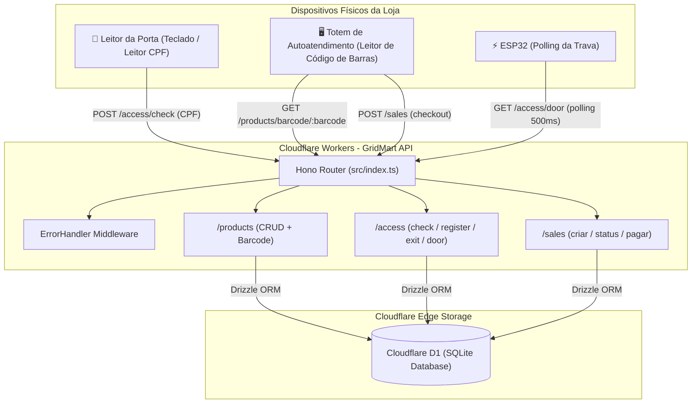
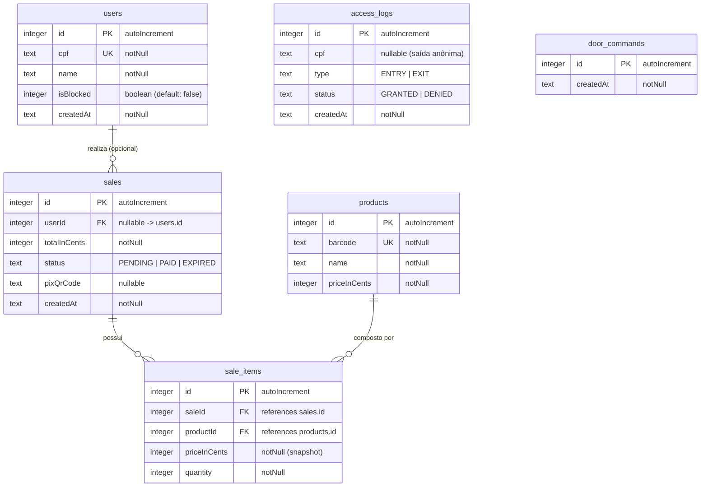

# 🛒 GridMart API

> **API Edge-Native para Mercados Autônomos e Lojas de Conveniência Inteligentes (Honest Market / Micromarket)**

A **GridMart API** é o backend central de uma solução de varejo autônomo sem atendentes (conceito de micromercado/honest market, totens de autoatendimento e controle de trava eletrônica de acesso). Construída com foco em altíssima performance, baixa latência e execução no *Edge* utilizando o ecossistema da Cloudflare.

---

## 📑 Índice

- [Visão Geral e Conceito](#-visão-geral-e-conceito)
- [🆕 Novidades desta Semana](#-novidades-desta-semana)
- [Stack Tecnológica](#-stack-tecnológica)
- [Arquitetura da Aplicação](#-arquitetura-da-aplicação)
- [Estrutura do Projeto](#-estrutura-do-projeto)
- [Modelagem do Banco de Dados (Schema D1)](#-modelagem-do-banco-de-dados-schema-d1)
- [Middlewares do Sistema](#-middlewares-do-sistema)
- [Utilitários](#-utilitários)
- [Documentação das Rotas da API](#-documentação-das-rotas-da-api)
  - [Módulo de Produtos (`/products`)](#módulo-de-produtos-products)
  - [Módulo de Acesso (`/access`)](#módulo-de-acesso-access)
  - [Módulo de Vendas (`/sales`)](#módulo-de-vendas-sales)
- [Firmware ESP32](#-firmware-esp32)
- [Convenções e Boas Práticas Adotadas](#-convenções-e-boas-práticas-adotadas)
- [Guia de Configuração e Execução Local](#-guia-de-configuração-e-execução-local)
- [Licença](#-licença)

---

## 💡 Visão Geral e Conceito

O GridMart atende a dois grandes fluxos operacionais de uma loja física autônoma:

1. **Controle de Acesso da Trava da Porta**:
   - Validação do cliente via CPF na entrada da loja.
   - Verificação se o usuário está cadastrado e ativo (`isBlocked = false`).
   - Registro de logs de auditoria de entrada e saída (`access_logs`) com status `GRANTED` ou `DENIED`.
   - Enfileiramento de comandos de abertura de porta consumidos pelo ESP32 via polling.

2. **Autoatendimento & Checkout no Totem**:
   - Consulta ágil de produtos por leitor de código de barras (`barcode`).
   - Criação de vendas vinculadas aos itens selecionados, com suporte a compras anônimas ou identificadas por usuário.
   - Geração de cobrança via **QR Code PIX estático** e confirmação de pagamento.

---

## 🆕 Novidades desta Semana

> Esta seção documenta tudo que foi implementado nos últimos 7 dias em relação à versão anterior do projeto.

---

### 🚀 Reestruturação do Projeto (`src/`)

O código-fonte foi movido para um diretório `src/` dedicado, reorganizando a estrutura de pastas para maior clareza e manutenibilidade. O `wrangler.jsonc` foi atualizado para apontar o `main` para `src/index.ts`.

---

### 🔐 Módulo de Acesso (`/access`) — **Implementado do zero**

O módulo que antes era apenas um placeholder no roadmap foi **completamente implementado** em [`src/modules/access/access.routes.ts`](file:///c:/Users/Usuario/gridmart-api/src/modules/access/access.routes.ts):

| Método | Endpoint | Descrição |
| :--- | :--- | :--- |
| `POST` | `/access/check` | Valida CPF e libera (ou nega) acesso na entrada |
| `POST` | `/access/register` | Cadastra novo usuário e já libera a porta |
| `POST` | `/access/exit` | Registra saída e libera a porta (CPF opcional) |
| `GET` | `/access/door` | Endpoint consumido pelo ESP32 via polling (autenticado por `x-door-token`) |

**Destaques:**
- Validação de CPF via `zod` + `isValidCPF` em todas as rotas de entrada.
- Geração de auditoria automática em `access_logs` em **todo** evento (entrada/saída, concedido/negado).
- **Sistema de fila de comandos (`door_commands`)**: em vez de acionar a fechadura diretamente, a API enfileira um comando na tabela `door_commands`. O ESP32 faz polling em `GET /access/door` e **consome e deleta** o primeiro comando da fila — garantindo que múltiplas pessoas entrando ao mesmo tempo não causem conflito.
- Endpoint `/access/door` protegido por token de segurança (`x-door-token`) via variável de ambiente `DOOR_TOKEN`.

---

### 🛒 Módulo de Vendas (`/sales`) — **Implementado do zero**

O módulo de checkout do totem foi **completamente implementado** em [`src/modules/sales/sales.routes.ts`](file:///c:/Users/Usuario/gridmart-api/src/modules/sales/sales.routes.ts):

| Método | Endpoint | Descrição |
| :--- | :--- | :--- |
| `POST` | `/sales` | Cria uma venda, calcula o total e gera o QR Code PIX |
| `GET` | `/sales/:id` | Consulta o status e detalhes de uma venda |
| `POST` | `/sales/:id/pay` | Confirma o pagamento de uma venda (status → `PAID`) |

**Destaques:**
- Validação de todos os `productId`s antes de confirmar a venda — retorna `404` se qualquer produto não existir.
- Suporte a compras **anônimas** (`userId` opcional) ou **identificadas** (vinculadas a um usuário).
- Geração de **PIX estático** embutida no endpoint `POST /sales` (MVP sem integração com PSP), com payload EMV completo.
- Snapshot de preço no momento da compra: o `priceInCents` de cada `sale_item` é capturado no ato da venda, independente de futuras alterações no catálogo.

---

### 🗄️ Novas Tabelas e Migrações no Schema

Duas novas tabelas foram adicionadas ao [`src/db/schema.ts`](file:///c:/Users/Usuario/gridmart-api/src/db/schema.ts):

**`door_commands`** — Fila de comandos de abertura de porta:
```typescript
export const doorCommands = sqliteTable("door_commands", {
  id: integer().primaryKey({ autoIncrement: true }),
  createdAt: text().notNull().$defaultFn(() => new Date().toISOString()),
});
```

**Schema de `access_logs` atualizado** — agora com campo `type` (`ENTRY` | `EXIT`) e `cpf` nullable (para saídas anônimas):
```typescript
export const accessLogs = sqliteTable("access_logs", {
  id: integer().primaryKey({ autoIncrement: true }),
  cpf: text(), // null na saída anônima
  type: text({ enum: ["ENTRY", "EXIT"] }).notNull(),
  status: text({ enum: ["GRANTED", "DENIED"] }).notNull(),
  createdAt: text().notNull().$defaultFn(() => new Date().toISOString()),
});
```

**Schema de `sales` atualizado** — agora com `userId` (FK opcional para `users`):
```typescript
userId: integer().references(() => users.id), // comprador (null = consumo anônimo)
```

Três arquivos de migração Drizzle foram gerados em `drizzle/`:
- `0000_long_thor_girl.sql` — Schema inicial
- `0001_dry_inhumans.sql` — Criação da tabela `door_commands` + correção dos tipos de FK em `sale_items`
- `0002_breezy_demogoblin.sql` — Adição do campo `type` em `access_logs`, `cpf` nullable e `userId` em `sales`

---

### 🧰 Novos Utilitários (`src/utils/`)

#### `api.ts` — Helpers centralizados da API
Arquivo novo que centraliza as funções utilitárias usadas em todas as rotas:
```typescript
export type Env = { Bindings: { DB: D1Database; DOOR_TOKEN: string } };
export const db = (c: Context<Env>) => drizzle(c.env.DB);
export const idParam = (c: Context) => { /* valida :id como inteiro positivo */ };
export const or404 = <T>(c: Context, item: T | undefined | null) =>
  item ? c.json(item) : c.json({ error: "Not Found" }, 404);
```
- Expõe o tipo `Env` (com o novo binding `DOOR_TOKEN`).
- Centraliza a função `db()` para instanciar o Drizzle.
- `idParam()`: parse e validação do parâmetro `:id` (retorna `undefined` se não for inteiro positivo).
- `or404()`: helper genérico que substitui o middleware `auto404` removido.

#### `crud.ts` — Factory de CRUD genérico
Arquivo novo que elimina boilerplate de rotas repetitivas:
```typescript
export function crud(app: Hono<Env>, table: SQLiteTableWithColumns<any>) {
  // Registra automaticamente: GET /, GET /:id, POST /, PUT /:id, DELETE /:id
}
```
O módulo de produtos agora tem apenas **13 linhas** graças a este utilitário.

#### `cpf.test.ts` — Testes unitários do validador de CPF
Suite de testes com **Bun Test** cobrindo os casos:
- CPFs válidos (com e sem formatação)
- Rejeição de CPFs com dígitos repetidos (`000...`, `111...`)
- Rejeição por tamanho incorreto (< 11 ou > 11 dígitos)
- Rejeição de dígitos verificadores inválidos

---

### 🔧 Melhorias no `errorHandler`

O middleware de erro foi aprimorado para detectar **violações de constraint UNIQUE** do SQLite e retornar `409 Conflict` com mensagem descritiva, em vez de `500 Internal Server Error`:

```typescript
const hasUniqueError = (err: any): boolean =>
  !!err && (err.message?.includes("UNIQUE constraint failed") || hasUniqueError(err.cause));

// Retorna 409 para UNIQUE violations, 500 para outros erros
const status = hasUniqueError(err) ? 409 : 500;
```

O middleware `auto404` foi **removido** e substituído pelo helper `or404()` em `utils/api.ts`, tornando o comportamento explícito em cada rota.

---

### ⚡ Firmware ESP32 (`esp32/door_lock.ino`) — **Implementado**

Firmware Arduino completo para o microcontrolador ESP32 que controla a trava eletromagnética da porta:
- Conecta ao Wi-Fi da loja.
- Faz **polling** a cada 500ms no endpoint `GET /access/door`.
- Ao receber um comando (HTTP 200), aciona o relé por **6 segundos** (`OPEN_MS`).
- Múltiplos comandos enfileirados no mesmo grupo de pessoas são descartados enquanto a porta estiver aberta — evitando que a porta bata em quem ainda está passando.
- Autenticado pelo header `x-door-token`.

---

### 📦 Atualizações de Dependências e Tooling

- **Bun** adotado como runtime principal de desenvolvimento e testes (substituindo Node.js).
- **Scripts** padronizados: `dev`, `deploy`, `db:generate`, `db:migrate`, `test`, `typecheck`.
- Novas dependências adicionadas:
  - `@hono/swagger-ui`, `@hono/zod-openapi`, `hono-openapi`, `@scalar/hono-api-reference` — infraestrutura para documentação OpenAPI futura.
- `wrangler.jsonc` migrado de `.toml` para `.jsonc`, com suporte a `migrations_dir` e variável `DOOR_TOKEN`.
- `CLAUDE.md` adicionado — guia de convenções do projeto para assistentes de IA.

---

## 🛠️ Stack Tecnológica

| Tecnologia | Finalidade | Justificativa / Benefício |
| :--- | :--- | :--- |
| **[TypeScript](https://www.typescriptlang.org/)** | Linguagem Principal | Tipagem estática rigorosa, produtividade e confiabilidade. |
| **[Hono](https://hono.dev/)** | Framework Web | Framework minimalista e ultrarrápido projetado para ambientes serverless e Edge runtimes. |
| **[Cloudflare Workers](https://workers.cloudflare.com/)** | Runtime Serverless | Execução distribuída globalmente na borda com latência próxima de zero. |
| **[Cloudflare D1](https://developers.cloudflare.com/d1/)** | Banco de Dados Relacional | Banco SQL Serverless distribuído baseado em SQLite nativo da Cloudflare. |
| **[Drizzle ORM](https://orm.drizzle.team/)** | ORM / Query Builder | Totalmente type-safe, leve, sem overhead e com suporte de primeira classe ao Cloudflare D1. |
| **[Zod](https://zod.dev/) & [Drizzle-Zod](https://orm.drizzle.team/docs/zod)** | Validação de Schemas | Validação declarativa e segura do payload de requisições HTTP integradas via `@hono/zod-validator`. |
| **[Bun](https://bun.sh/)** | Runtime & Test Runner | Runtime JavaScript ultrarrápido, substitui Node.js + Jest. Utilizado para `bun test`. |
| **[ESP32 (Arduino)](https://www.espressif.com/)** | Firmware IoT | Microcontrolador que controla fisicamente a trava da porta via polling na API. |

---

## 🏛️ Arquitetura da Aplicação



---

## 📁 Estrutura do Projeto

```
gridmart-api/
├── src/
│   ├── db/
│   │   └── schema.ts                   # Definição de todas as tabelas com Drizzle ORM
│   ├── middlewares/
│   │   └── errorHandler.ts             # Tratamento global: 409 (UNIQUE), 500 (outros)
│   ├── modules/
│   │   ├── access/
│   │   │   └── access.routes.ts        # check, register, exit, door (ESP32 polling)
│   │   ├── products/
│   │   │   └── products.routes.ts      # CRUD via factory + busca por barcode
│   │   └── sales/
│   │       └── sales.routes.ts         # Criar venda com PIX, status e confirmação
│   ├── utils/
│   │   ├── api.ts                      # Env type, db(), idParam(), or404()
│   │   ├── cpf.ts                      # Algoritmo de validação de CPF (módulo 11)
│   │   ├── cpf.test.ts                 # Testes unitários do validador (Bun Test)
│   │   └── crud.ts                     # Factory de CRUD genérico para qualquer tabela
│   └── index.ts                        # Ponto de entrada: registra rotas e middlewares
├── esp32/
│   └── door_lock.ino                   # Firmware ESP32 (polling, relé, trava eletromagnética)
├── drizzle/
│   ├── 0000_long_thor_girl.sql         # Schema inicial
│   ├── 0001_dry_inhumans.sql           # door_commands + fix FKs de sale_items
│   └── 0002_breezy_demogoblin.sql      # type em access_logs, cpf nullable, userId em sales
├── drizzle.config.ts                   # Configuração do Drizzle Kit
├── wrangler.jsonc                      # Configuração do Cloudflare Workers/D1
├── package.json                        # Scripts e dependências
├── tsconfig.json                       # Configuração TypeScript
└── README.md                           # Documentação do projeto
```

---

## 🗄️ Modelagem do Banco de Dados (Schema D1)

O schema está definido em [`src/db/schema.ts`](file:///c:/Users/Usuario/gridmart-api/src/db/schema.ts) utilizando o driver `sqlite-core` do Drizzle ORM.



### Detalhamento das Tabelas

#### 1. `users` (Controle de Clientes)
Armazena os usuários autorizados a acessar a loja física.
- `id` (`INTEGER`, Primary Key, Auto Increment)
- `cpf` (`TEXT`, Not Null, Unique): CPF do cliente utilizado para liberação da trava.
- `name` (`TEXT`, Not Null): Nome completo do cliente.
- `isBlocked` (`INTEGER` / boolean, Default: `false`): Flag para bloquear clientes inadimplentes ou suspensos.
- `createdAt` (`TEXT`, Not Null): Data/hora de registro (formato ISO, gerado automaticamente via `$defaultFn`).

#### 2. `access_logs` (Auditoria da Fechadura)
Histórico de todas as tentativas de destravamento e registros de saída.
- `id` (`INTEGER`, Primary Key, Auto Increment)
- `cpf` (`TEXT`, **Nullable**): CPF submetido. Pode ser `null` em saídas anônimas.
- `type` (`TEXT`, Not Null): Direção do acesso — `'ENTRY'` (entrada) ou `'EXIT'` (saída). *(campo novo)*
- `status` (`TEXT`, Not Null): Resultado — `'GRANTED'` (liberado) ou `'DENIED'` (negado).
- `createdAt` (`TEXT`, Not Null): Timestamp do evento.

#### 3. `products` (Catálogo de Mercadorias)
Produtos comercializados, identificados pelo código de barras do totem.
- `id` (`INTEGER`, Primary Key, Auto Increment)
- `barcode` (`TEXT`, Not Null, Unique): Código de barras (EAN-13, UPC, etc.).
- `name` (`TEXT`, Not Null): Descrição/nome comercial do produto.
- `priceInCents` (`INTEGER`, Not Null): Preço unitário em centavos.

#### 4. `sales` (Cabeçalho de Vendas do Totem)
Registra cada transação finalizada no totem de autoatendimento.
- `id` (`INTEGER`, Primary Key, Auto Increment)
- `userId` (`INTEGER`, **Nullable**, FK → `users.id`): Comprador identificado. `null` = compra anônima. *(campo novo)*
- `totalInCents` (`INTEGER`, Not Null): Valor total do pedido em centavos.
- `status` (`TEXT`, Not Null): Status do pagamento (`'PENDING'`, `'PAID'`, `'EXPIRED'`).
- `pixQrCode` (`TEXT`, Nullable): Payload EMV do QR Code PIX gerado para pagamento.
- `createdAt` (`TEXT`, Not Null): Timestamp de abertura da venda.

#### 5. `sale_items` (Itens da Venda)
Relaciona os produtos ao pedido correspondente, guardando o snapshot do preço.
- `id` (`INTEGER`, Primary Key, Auto Increment)
- `saleId` (`INTEGER`, Not Null, FK → `sales.id`)
- `productId` (`INTEGER`, Not Null, FK → `products.id`)
- `priceInCents` (`INTEGER`, Not Null): Preço praticado no momento da transação (snapshot).
- `quantity` (`INTEGER`, Not Null): Quantidade do item no carrinho.

#### 6. `door_commands` (Fila de Abertura da Porta) *(tabela nova)*
Fila de comandos enfileirados pela API e consumidos pelo ESP32 via polling.
- `id` (`INTEGER`, Primary Key, Auto Increment)
- `createdAt` (`TEXT`, Not Null): Timestamp do enfileiramento do comando.

---

## 🛡️ Middlewares do Sistema

### `errorHandler` ([`src/middlewares/errorHandler.ts`](file:///c:/Users/Usuario/gridmart-api/src/middlewares/errorHandler.ts))
Interceptador global de erros do Hono (`app.onError(errorHandler)`):
- Captura exceções não tratadas nas rotas.
- Registra no console o método, a rota e o stack do erro.
- Detecta **violações de constraint `UNIQUE`** do SQLite e retorna `409 Conflict` com mensagem `"Conflito: registro já existe"`.
- Para outros erros, retorna `500 Internal Server Error` com mensagem `"Erro interno"`.

> O middleware `auto404` foi **removido**. O comportamento de 404 agora é explícito via `or404()` em `utils/api.ts`.

---

## 🧰 Utilitários

### `api.ts` ([`src/utils/api.ts`](file:///c:/Users/Usuario/gridmart-api/src/utils/api.ts))

Centraliza as funções e tipos usados em todas as rotas:

| Export | Tipo | Descrição |
| :--- | :--- | :--- |
| `Env` | `type` | Bindings da Worker: `DB: D1Database` e `DOOR_TOKEN: string` |
| `db(c)` | `function` | Instancia o cliente Drizzle a partir do contexto Hono |
| `idParam(c)` | `function` | Parseia e valida o parâmetro `:id` como inteiro positivo |
| `or404(c, item)` | `function` | Retorna `c.json(item)` ou `404 Not Found` se nulo/indefinido |

### `crud.ts` ([`src/utils/crud.ts`](file:///c:/Users/Usuario/gridmart-api/src/utils/crud.ts))

Factory que registra as 5 rotas CRUD padrão em qualquer rota Hono para qualquer tabela Drizzle:
- `GET /` — Lista todos os registros
- `GET /:id` — Busca por ID
- `POST /` — Cria com validação via `drizzle-zod`
- `PUT /:id` — Atualiza parcialmente (schema `.partial()`)
- `DELETE /:id` — Remove por ID

### `cpf.ts` ([`src/utils/cpf.ts`](file:///c:/Users/Usuario/gridmart-api/src/utils/cpf.ts))

Exporta `isValidCPF(cpf: string): boolean`:
- Remove caracteres não numéricos.
- Bloqueia sequências repetidas inválidas (`000...`, `111...`, etc.).
- Valida os dois dígitos verificadores via algoritmo módulo 11 da Receita Federal.

### `cpf.test.ts` ([`src/utils/cpf.test.ts`](file:///c:/Users/Usuario/gridmart-api/src/utils/cpf.test.ts))

Suite de testes unitários com **Bun Test** (`bun test`). Cobertura completa: CPFs válidos, dígitos repetidos, tamanho incorreto e dígitos verificadores inválidos.

---

## 📡 Documentação das Rotas da API

### Módulo de Produtos (`/products`)

Gerencia o catálogo de produtos lidos pelo leitor de código de barras do totem.

| Método | Endpoint | Descrição | Status de Sucesso |
| :--- | :--- | :--- | :--- |
| `GET` | `/products` | Lista todos os produtos cadastrados | `200 OK` |
| `GET` | `/products/:id` | Busca produto pelo ID numérico | `200 OK` / `404 Not Found` |
| `GET` | `/products/barcode/:barcode` | Busca produto pelo código de barras | `200 OK` / `404 Not Found` |
| `POST` | `/products` | Cadastra um novo produto no catálogo | `201 Created` |
| `PUT` | `/products/:id` | Atualiza dados de um produto | `200 OK` |
| `DELETE` | `/products/:id` | Remove um produto pelo ID | `200 OK` |

#### Exemplos

**`GET /products`** — Resposta `200 OK`:
```json
[
  { "id": 1, "barcode": "7891000100103", "name": "Refrigerante Coca-Cola 350ml", "priceInCents": 550 },
  { "id": 2, "barcode": "7891000245678", "name": "Chocolate Barra 90g", "priceInCents": 790 }
]
```

**`POST /products`** — Corpo:
```json
{ "barcode": "7894900010015", "name": "Água Mineral Sem Gás 500ml", "priceInCents": 300 }
```
Resposta `201 Created`:
```json
{ "id": 3, "barcode": "7894900010015", "name": "Água Mineral Sem Gás 500ml", "priceInCents": 300 }
```

---

### Módulo de Acesso (`/access`)

Controla a trava eletrônica da porta de entrada da loja.

| Método | Endpoint | Descrição | Status de Sucesso |
| :--- | :--- | :--- | :--- |
| `POST` | `/access/check` | Valida CPF e nega ou libera a entrada | `200 OK` / `403 Forbidden` |
| `POST` | `/access/register` | Cadastra novo usuário e libera a porta | `201 Created` |
| `POST` | `/access/exit` | Registra saída e libera a porta | `200 OK` |
| `GET` | `/access/door` | Consome o próximo comando de abertura (ESP32) | `200 OK` |

#### `POST /access/check`
- **Corpo**: `{ "cpf": "529.982.247-25" }`
- **Resposta (usuário liberado)**:
```json
{ "registered": true, "allowed": true, "name": "João Silva" }
```
- **Resposta (usuário bloqueado)** `403`:
```json
{ "registered": true, "allowed": false, "error": "Acesso bloqueado" }
```
- **Resposta (CPF não cadastrado)**:
```json
{ "registered": false, "allowed": false }
```

#### `POST /access/register`
- **Corpo**: `{ "cpf": "529.982.247-25", "name": "Maria Oliveira" }`
- **Resposta** `201 Created`:
```json
{ "registered": true, "allowed": true, "name": "Maria Oliveira" }
```

#### `POST /access/exit`
- **Corpo**: `{ "cpf": "529.982.247-25" }` *(ou `{}` para saída anônima)*
- **Resposta** `200 OK`:
```json
{ "allowed": true }
```

#### `GET /access/door` *(endpoint para o ESP32)*
- **Header obrigatório**: `x-door-token: <DOOR_TOKEN>`
- **Resposta quando há comando na fila** `200 OK` — retorna e **deleta** o primeiro comando:
```json
{ "id": 42, "createdAt": "2026-09-25T03:15:00.000Z" }
```
- **Resposta quando a fila está vazia** `200 OK` com body `null` → o ESP32 **não abre a porta**.
- **Sem o token**: `401 Unauthorized`.

---

### Módulo de Vendas (`/sales`)

Gerencia o checkout do totem de autoatendimento.

| Método | Endpoint | Descrição | Status de Sucesso |
| :--- | :--- | :--- | :--- |
| `POST` | `/sales` | Cria uma venda e gera o QR Code PIX | `201 Created` |
| `GET` | `/sales/:id` | Consulta status e detalhes de uma venda | `200 OK` / `404 Not Found` |
| `POST` | `/sales/:id/pay` | Confirma o pagamento (status → `PAID`) | `200 OK` |

#### `POST /sales`
- **Corpo** (compra anônima):
```json
{
  "items": [
    { "productId": 1, "quantity": 2 },
    { "productId": 3, "quantity": 1 }
  ]
}
```
- **Corpo** (compra identificada, `userId` opcional):
```json
{
  "userId": 5,
  "items": [{ "productId": 2, "quantity": 1 }]
}
```
- **Resposta** `201 Created`:
```json
{
  "id": 10,
  "userId": null,
  "totalInCents": 1400,
  "status": "PENDING",
  "pixQrCode": "00020126580014br.gov.bcb.pix...",
  "createdAt": "2026-09-25T03:20:00.000Z",
  "items": [
    { "productId": 1, "quantity": 2, "priceInCents": 550 },
    { "productId": 3, "quantity": 1, "priceInCents": 300 }
  ]
}
```

#### `POST /sales/:id/pay`
- **URL**: `/sales/10/pay`
- **Resposta** `200 OK`:
```json
{ "id": 10, "status": "PAID", "totalInCents": 1400 }
```

---

## ⚡ Firmware ESP32

O arquivo [`esp32/door_lock.ino`](file:///c:/Users/Usuario/gridmart-api/esp32/door_lock.ino) contém o firmware Arduino para o ESP32 que controla a trava eletromagnética da porta.

### Fluxo de Operação

```
ESP32 liga → conecta ao Wi-Fi da loja
     ↓
Loop a cada 500ms:
  ├── Porta aberta há > 6s? → fecha o relé (trava)
  └── Porta fechada? → GET /access/door (com x-door-token)
          ├── HTTP 200 → abre o relé (libera porta por 6s)
          └── body null → faz nada (sem comando na fila)
```

### Configurações no Firmware

| Constante | Valor padrão | Descrição |
| :--- | :--- | :--- |
| `RELAY_PIN` | `23` | Pino GPIO conectado ao módulo relé |
| `POLL_MS` | `500ms` | Intervalo entre polls na API |
| `OPEN_MS` | `6000ms` | Tempo que a porta permanece aberta |

### Configuração necessária antes do upload

```cpp
const char* ssid       = "WIFI_DA_LOJA";
const char* password   = "SENHA_DO_WIFI";
const char* apiUrl     = "https://gridmart-api.seu-dominio.workers.dev/access/door";
const char* doorToken  = "MESMO_TOKEN_DA_VAR_DOOR_TOKEN";
```

---

## 💎 Convenções e Boas Práticas Adotadas

1. **Preços em Centavos (`priceInCents`, `totalInCents`)**:
   - Evita problemas de arredondamento com floats. Ex: `R$ 19,99` = `1999`.

2. **Validação na Borda com Zod**:
   - Todas as requisições são validadas antes de tocar no banco via `@hono/zod-validator`.

3. **Status Codes Semânticos**:
   - `201 Created` para inserções, `404 Not Found` para buscas sem resultado, `409 Conflict` para duplicatas, `403 Forbidden` para acesso bloqueado.

4. **Arquitetura de Fila para IoT**:
   - A API não aciona a fechadura diretamente — ela enfileira comandos. O ESP32 consome a fila, desacoplando o hardware do backend e tornando o sistema resiliente a latências de rede.

5. **Snapshots de Preço em Vendas**:
   - O preço de cada item é gravado no momento da compra em `sale_items.priceInCents`, protegendo o histórico de transações contra alterações futuras no catálogo.

6. **Factory de CRUD (`crud.ts`)**:
   - Elimina código repetitivo. Adicionar um novo módulo com CRUD completo requer apenas duas linhas.

7. **Bun como Runtime de Dev & Testes**:
   - `bun test` executa os testes unitários. `bun run dev` inicia o servidor local.

---

## 🚀 Guia de Configuração e Execução Local

### Pré-requisitos
- [Bun](https://bun.sh/) (runtime principal)
- [Wrangler CLI](https://developers.cloudflare.com/workers/wrangler/) (Cloudflare Developer Platform)

### 1. Instalação das Dependências

```bash
bun install
```

### 2. Configurar variáveis de ambiente

O arquivo `wrangler.jsonc` já vem pré-configurado com um `DOOR_TOKEN` de desenvolvimento. Para produção, configure o secret:

```bash
wrangler secret put DOOR_TOKEN
```

### 3. Migrações do Banco de Dados

```bash
# Gerar arquivos SQL de migração (após alterar o schema)
bun run db:generate

# Aplicar migrações no banco local D1
bun run db:migrate
```

### 4. Executar em Modo de Desenvolvimento

```bash
bun run dev
```

A API estará disponível em `http://localhost:8787`.

### 5. Executar Testes

```bash
bun test
```

### 6. Deploy para Cloudflare Workers

```bash
bun run deploy
```

---

## 📄 Licença

Este projeto é distribuído sob os termos da licença [MIT](file:///c:/Users/Usuario/gridmart-api/LICENSE).
